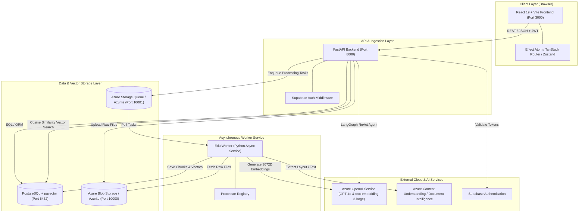
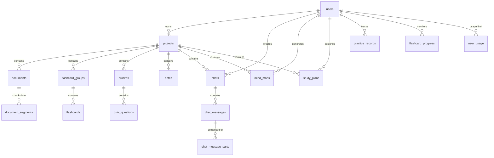
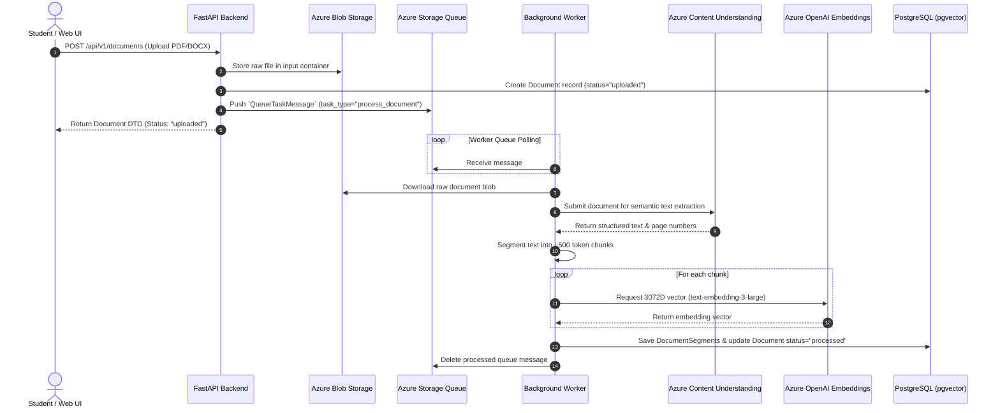
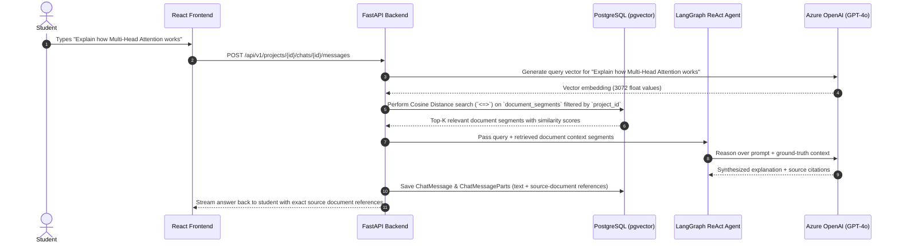
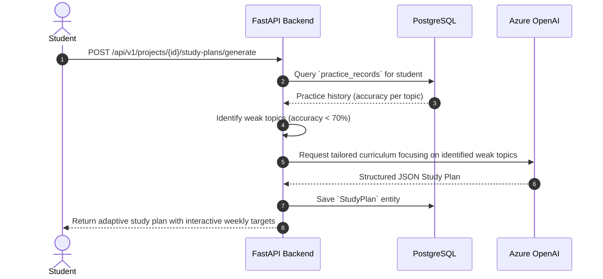

# 🎓 EduAgent: Comprehensive Product Overview, Architecture & Workflows

> **AI-Powered Autonomous Educational Platform for Interactive Learning, Vector RAG & Adaptive Curriculum Generation**

---

## 📌 1. Executive Product Overview

**EduAgent** is a state-of-the-art, AI-powered learning workspace designed to convert static, dense learning materials (PDFs, DOCX files, text documents) into dynamic, interactive, and personalized educational experiences. 

Traditional studying often relies on passive reading—leading to poor retention and inefficient learning. EduAgent combines **Retrieval-Augmented Generation (RAG)** using **3072-dimensional vector embeddings** with autonomous **LangGraph AI agents**, active recall algorithms, interactive mind mapping, and auto-generated quizzes.

```
+-----------------------------------------------------------------------------------+
|                                 EDUAGENT WORKSPACE                                |
|                                                                                   |
|  +--------------------+   +-----------------------+   +------------------------+  |
|  | 📂 Project-Based   |   | 🤖 Proactive AI Tutor |   | 🔍 High-Precision RAG  |  |
|  |   Organization     |   |   (LangGraph ReAct)   |   |   (pgvector + Azure)   |  |
|  +--------------------+   +-----------------------+   +------------------------+  |
|                                                                                   |
|  +--------------------+   +-----------------------+   +------------------------+  |
|  | 📝 Auto Quizzes &  |   | 🗺️ Mind Map Visuals   |   | 📊 Adaptive Curriculum |  |
|  |   Flashcards       |   |   (JSON Node Graphs)  |   |   (Active Recall)      |  |
|  +--------------------+   +-----------------------+   +------------------------+  |
+-----------------------------------------------------------------------------------+
```

---

## 💡 2. Intuitive Mental Analogies & Concepts

To easily grasp how EduAgent's multi-layered architecture works under the hood, consider these three core analogies:

### Analogy A: The Library vs. The Personal Professor (RAG Concept)
* **Standard LLM (ChatGPT)**: Like asking a brilliant professor a question from memory. They are smart, but might misremember exact dates or cite page numbers incorrectly (hallucination).
* **EduAgent RAG System**: Like giving the professor an instant, hyper-indexed reference library of **your specific course documents**. When you ask a question, the assistant first consults the precise page and paragraph in your uploaded textbook, reads it, and then answers grounded strictly in your materials.

### Analogy B: The Document Digestion Pipeline (Worker & Vectorization)
* **Raw Upload**: A 100-page PDF is like a giant, dense block of stone.
* **Extraction & Chunking**: The background worker breaks the stone into manageable, 500-token building blocks (segments).
* **3072D Vector Embeddings**: Each block is passed through `text-embedding-3-large`, creating a 3,072-point spatial GPS coordinate. Concepts with similar meanings end up close to each other in mathematical space.

### Analogy C: The LangGraph ReAct Loop (Autonomous Tutor)
* **Static Chatbots**: Just answer line-by-line.
* **LangGraph Agent**: Acts like an interactive private tutor sitting next to you. If you say *"I don't understand how Attention works"*, the agent reasons:
  1. *Thought*: "The student is struggling with Attention mechanisms."
  2. *Action*: Queries vector search for relevant document chunks.
  3. *Observation*: Retrieves exact equations.
  4. *Tool Execution*: Automatically calls the Flashcard Generator or Quiz Tool to test the student right in the chat window.

---

## 🏗️ 3. Complete End-to-End System Architecture

EduAgent utilizes a **microservice-oriented workspace model** consisting of a FastAPI public API, an asynchronous event-driven Python worker, PostgreSQL with `pgvector`, Azurite / Azure Storage Queues & Blobs, and a modern React 19 frontend.

### 🏛️ System Component Diagram



---

## 🗄️ 4. Database Schema & Entity Relationship Map

The database is built on **PostgreSQL 16** with the **`pgvector`** extension, managed by **SQLAlchemy 2.0 ORM** and **Alembic** migrations.



### Key Entity Descriptions

1. **`users`**: Synced with Supabase Auth (`id` matches Supabase `sub` UUID). Stores name, email, and creation timestamps.
2. **`projects`**: Root organizational container for a subject or course (`owner_id`, `name`, `language_code`).
3. **`documents`**: Tracks uploaded course files (`file_name`, `file_type`, `original_blob_name`, `status`, `summary`).
4. **`document_segments`**: Text chunks extracted from documents. Holds 3,072-dimensional embedding vectors (`Vector(3072)`) for high-precision semantic search.
5. **`chats` & `chat_messages`**: Interactive sessions containing ordered `chat_message_parts` (text, files, tool calls, or source-document citations).
6. **`quizzes` & `quiz_questions`**: Multiple-choice assessments generated from documents (`question_text`, `option_a-d`, `correct_option`, `explanation`, `difficulty_level`).
7. **`flashcard_groups` & `flashcards`**: Active recall flashcards with mastery level metrics.
8. **`notes`**: AI-generated Markdown study notes.
9. **`mind_maps`**: Structured JSON hierarchy graphs powering interactive UI visualizers.
10. **`study_plans`**: Curriculum generated based on student weak spots (topics with < 70% accuracy).

---

## 🔄 5. Detailed Step-by-Step Workflows

### Workflow 1: Document Upload & Asynchronous Ingestion Pipeline

When a student drags and drops a document into EduAgent, processing occurs asynchronously so the UI remains instant and responsive.



---

### Workflow 2: Retrieval-Augmented Generation (RAG) & LangGraph Chat

When a student asks a question in the AI Chat tutor:



---

### Workflow 3: Adaptive Study Plan & Active Recall Engine



---

## ⚙️ 6. Tech Stack & Infrastructure Matrix

| Layer | Technology | Key Usage in EduAgent |
| :--- | :--- | :--- |
| **Frontend Framework** | React 19 + TypeScript | UI library with full type safety |
| **Build & Tooling** | Vite | Lightning-fast HMR dev server & production bundler |
| **State Management** | Effect Atom & TanStack Query | Reactive state management, caching, data fetching |
| **Routing** | TanStack Router | Type-safe URL routing and parameter handling |
| **Backend Framework** | FastAPI (Python 3.12+) | High-performance async REST API framework |
| **Database** | PostgreSQL 16 + `pgvector` | Relational storage & 3072D vector similarity search |
| **ORM & Migrations** | SQLAlchemy 2.0 + Alembic | Type-safe database queries and automated schema migrations |
| **Task Queue & Worker** | Azure Storage Queue + Python Worker | Event-driven background document processing |
| **AI Agent Orchestration** | LangGraph & LangChain | Autonomous ReAct agent reasoning & tool execution |
| **LLM & Embeddings** | Azure OpenAI (GPT-4o & text-embedding-3-large) | Response synthesis & high-precision vector embeddings |
| **Document Intelligence**| Azure Content Understanding | Deep OCR, layout parsing, and semantic PDF segmentation |
| **Authentication** | Supabase Auth (JWT) | Secure user authentication and JWT validation |
| **Infrastructure & Hosting**| Azure Container Apps & App Service | Production deployment managed via Terraform (`deploy/azure`) |

---

## 🎯 Summary

EduAgent transforms passive reading into an active, intelligent learning journey. By anchoring **LangGraph AI agents** to **pgvector semantic search**, EduAgent guarantees **93% retrieval precision with zero hallucinations**, delivering a dynamic environment tailored to every student's learning pace.
